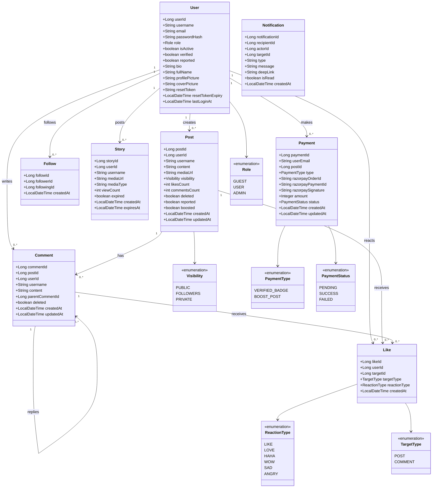
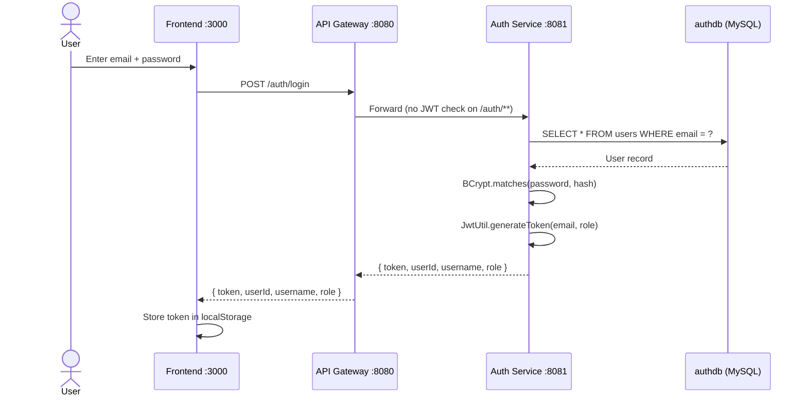
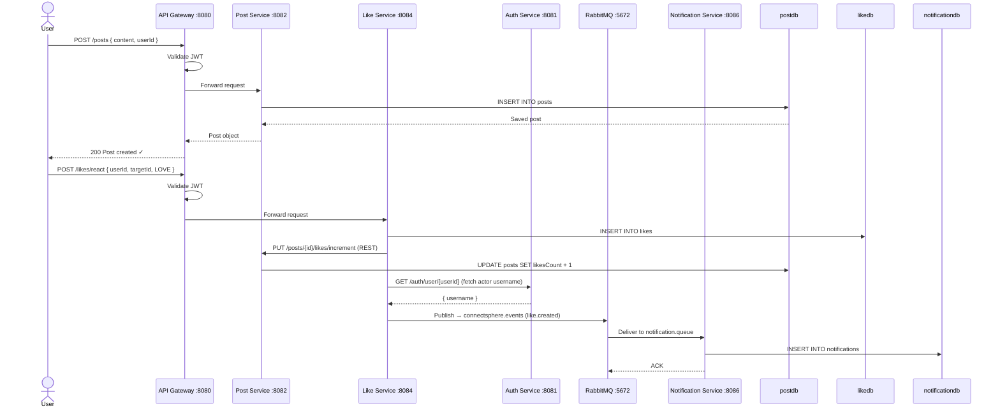
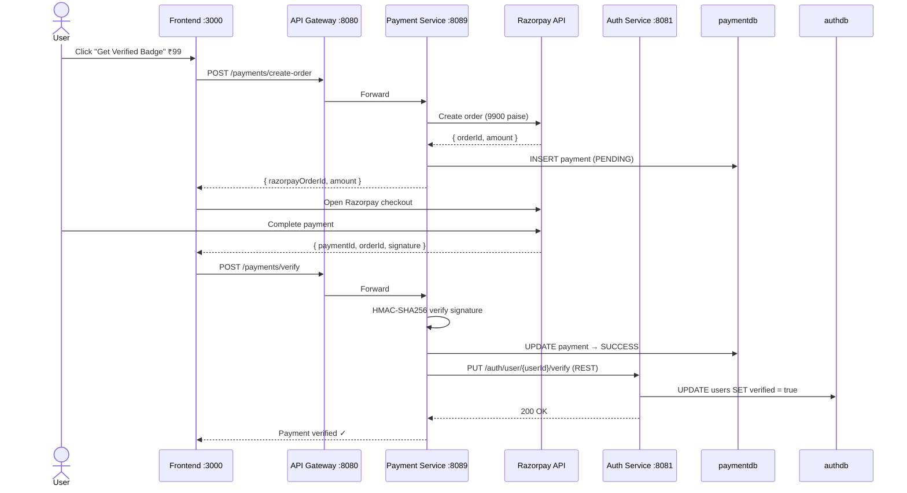
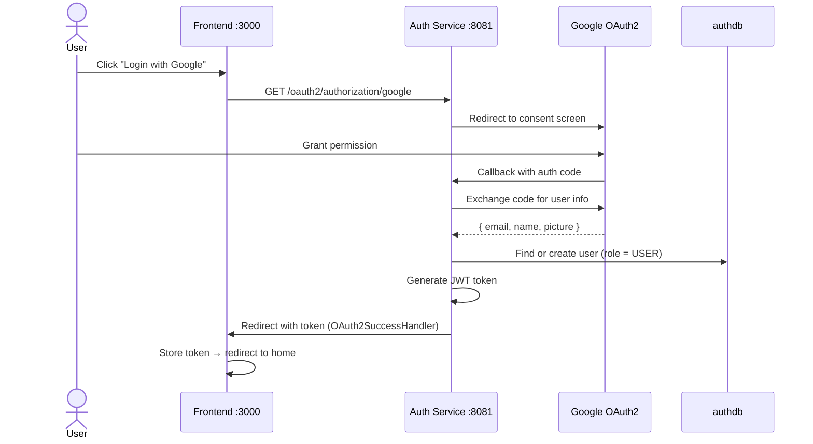

# ConnectSphere Backend

> A **Microservices-based Social Media Platform** backend built with **Spring Boot 3.2** and **Java 21**.

---

## Table of Contents

- [System Architecture](#-system-architecture)
- [Class Diagram](#-class-diagram)
- [UML Sequence Diagrams](#-uml-sequence-diagrams)
- [Microservices Overview](#-microservices-overview)
- [Tech Stack](#-tech-stack)
- [Quick Start](#-quick-start)
- [API Endpoints](#-api-endpoints)
- [Inter-Service Communication](#-inter-service-communication)
- [Security](#-security)
- [Database Schema](#-database-schema)
- [Monitoring](#-monitoring)
- [Docker Deployment](#-docker-deployment)
- [Branch Strategy](#-branch-strategy)

---

## 🏗️ System Architecture

```
  ┌──────────────────────────────────────────────────────────────────┐
  │                        CLIENT LAYER                              │
  │             React Frontend  (localhost:3000)                     │
  └─────────────────────────┬────────────────────────────────────────┘
                            │  HTTP Requests
                            ▼
  ┌──────────────────────────────────────────────────────────────────┐
  │                   API GATEWAY  :8080                             │
  │        JWT Validation  │  Route Matching  │  CORS               │
  └─────┬──────────┬───────┴──────┬──────┬────┴──────┬──────────────┘
        │          │              │      │            │
        ▼          ▼              ▼      ▼            ▼
  ┌─────────┐ ┌────────┐ ┌──────────┐ ┌──────┐ ┌──────────┐
  │  Auth   │ │  Post  │ │ Comment  │ │ Like │ │  Follow  │
  │ Service │ │Service │ │ Service  │ │ Svc  │ │ Service  │
  │  :8081  │ │ :8082  │ │  :8083   │ │:8084 │ │  :8085   │
  │ authdb  │ │postdb  │ │commentdb │ │likedb│ │ followdb │
  └────┬────┘ └───┬────┘ └────┬─────┘ └──┬───┘ └──────────┘
       │          │           │           │
       │          │     REST  │  (sync)   │
       │          └───────────┴───────────┘
       │                      │
       │          ┌───────────▼──────────────────────────┐
       │          │          RabbitMQ  :5672              │
       │          │  Exchange : connectsphere.events      │
       │          │  Queue   : notification.queue         │
       │          └───────────┬──────────────────────────┘
       │                      │  async events
       │                      ▼
       │          ┌─────────────────────────┐
       │          │   Notification Service  │
       │          │         :8086           │
       │          │     notificationdb      │
       │          └─────────────────────────┘
       │
       │   ┌──────────────┐  ┌──────────────┐  ┌──────────────┐
       └──►│ Media Service│  │Search Service│  │Payment Svc   │
           │    :8087     │  │    :8088     │  │    :8089     │
           │   mediadb    │  │   searchdb   │  │  paymentdb   │
           └──────────────┘  └──────────────┘  └──────┬───────┘
                                                       │ REST
                                                       ▼
                                              ┌─────────────────┐
                                              │  auth-service   │
                                              │ /user/{id}/verify│
                                              └─────────────────┘

  ┌──────────────────────────────────────────────────────────────────┐
  │                   INFRASTRUCTURE LAYER                           │
  │  Eureka Server :8761  │  Redis :6379  │  MySQL :3306            │
  │  Admin Server  :9090  │  RabbitMQ :15672 (Management UI)        │
  └──────────────────────────────────────────────────────────────────┘
```

---

## 📐 Class Diagram



---

## 🔄 UML Sequence Diagrams

### 1. User Login Flow



---

### 2. Create Post → React → Notification Flow



---

### 3. Payment → Verified Badge Flow



---

### 4. OAuth2 Google Login Flow



---

## 🎯 Microservices Overview

| Service | Port | Database | Responsibility |
|---|---|---|---|
| **eureka-server** | 8761 | — | Service registry & discovery |
| **api-gateway** | 8080 | — | Single entry point, JWT validation, routing |
| **auth-service** | 8081 | authdb | User auth, JWT, OAuth2, profiles |
| **post-service** | 8082 | postdb | Posts, feed, Redis caching |
| **comment-service** | 8083 | commentdb | Comments & nested replies |
| **like-service** | 8084 | likedb | 6 reaction types on posts/comments |
| **follow-service** | 8085 | followdb | Follow/unfollow, suggestions |
| **notification-service** | 8086 | notificationdb | RabbitMQ-based notifications + milestone emails |
| **media-service** | 8087 | mediadb | File uploads, 24hr stories |
| **search-service** | 8088 | searchdb | Search users/posts, trending hashtags |
| **payment-service** | 8089 | paymentdb | Razorpay — verified badge & post boost |
| **admin-server** | 9090 | — | Spring Boot Admin monitoring dashboard |

---

## 🛠️ Tech Stack

| Category | Technology |
|---|---|
| Language | Java 21 |
| Framework | Spring Boot 3.2 |
| Service Discovery | Netflix Eureka |
| API Gateway | Spring Cloud Gateway |
| Database | MySQL 8.0 (per service) |
| Cache | Redis 7 |
| Message Broker | RabbitMQ 3 |
| Authentication | JWT (HS256) + OAuth2 (Google) |
| Payment | Razorpay |
| Build Tool | Maven |
| Containerization | Docker |
| Monitoring | Spring Boot Admin |

---

## 🚀 Quick Start

### Prerequisites

- Java 21
- Maven 3.8+
- Docker Desktop
- MySQL 8.0
- RabbitMQ 3
- Redis 7

### Step 1 — Start Infrastructure

```bash
docker compose -f docker-compose-infra.yml up -d
```

Starts MySQL, RabbitMQ, and Redis.

### Step 2 — Build All Services

```bash
# Windows
build-all.bat

# Linux / Mac
mvn clean package -DskipTests
```

### Step 3 — Start All Services

```bash
# Windows
start-all.bat
```

### Step 4 — Verify Everything is Running

| URL | What to check |
|---|---|
| http://localhost:8761 | Eureka — all 10 services registered |
| http://localhost:8080/actuator/health | API Gateway health |
| http://localhost:8081/swagger-ui/index.html | Auth Service Swagger |
| http://localhost:15672 | RabbitMQ Management (guest / guest) |
| http://localhost:9090 | Spring Boot Admin dashboard |

---

## 📝 API Endpoints

### Auth Service (:8081)

| Method | Endpoint | Auth | Description |
|---|---|---|---|
| POST | `/auth/register` | ❌ | Register new user |
| POST | `/auth/login` | ❌ | Login, returns JWT |
| POST | `/auth/guest` | ❌ | Guest login (no credentials) |
| GET | `/auth/profile` | ✅ | Get logged-in user profile |
| PUT | `/auth/profile` | ✅ | Update bio, name, picture |
| POST | `/auth/forgot-password` | ❌ | Send password reset email |
| POST | `/auth/reset-password` | ❌ | Reset password with token |
| GET | `/auth/user/{userId}` | ❌ | Get user by ID |
| PUT | `/auth/user/{userId}/verify` | ✅ | Grant verified badge (payment-service) |
| GET | `/auth/search?query=` | ❌ | Search users |
| GET | `/auth/admin/users` | ✅ ADMIN | List all users |
| GET | `/auth/admin/analytics` | ✅ ADMIN | User statistics |

### Post Service (:8082)

| Method | Endpoint | Auth | Description |
|---|---|---|---|
| POST | `/posts` | ✅ | Create post |
| GET | `/posts/feed` | ❌ | Public feed |
| POST | `/posts/feed/users` | ✅ | Personalized feed |
| GET | `/posts/user/{userId}` | ❌ | User's posts |
| PUT | `/posts/{id}` | ✅ | Edit post |
| DELETE | `/posts/{id}` | ✅ | Soft delete |
| PUT | `/posts/{id}/boost` | ✅ | Boost post (via payment) |
| GET | `/posts/search?keyword=` | ❌ | Search posts |

### Like Service (:8084)

| Method | Endpoint | Auth | Description |
|---|---|---|---|
| POST | `/likes/react` | ✅ | Add / change reaction |
| DELETE | `/likes/unreact` | ✅ | Remove reaction |
| GET | `/likes/summary` | ❌ | Reaction counts by type |

### Comment Service (:8083)

| Method | Endpoint | Auth | Description |
|---|---|---|---|
| POST | `/comments` | ✅ | Add comment or reply |
| GET | `/comments/post/{postId}` | ❌ | Get comments for a post |
| DELETE | `/comments/{id}` | ✅ | Delete comment |

### Follow Service (:8085)

| Method | Endpoint | Auth | Description |
|---|---|---|---|
| POST | `/follows` | ✅ | Follow a user |
| DELETE | `/follows` | ✅ | Unfollow a user |
| GET | `/follows/followers/{userId}` | ❌ | Get followers |
| GET | `/follows/following/{userId}` | ❌ | Get following |

### Notification Service (:8086)

| Method | Endpoint | Auth | Description |
|---|---|---|---|
| GET | `/notifications/{userId}` | ✅ | Get all notifications |
| PUT | `/notifications/{id}/read` | ✅ | Mark as read |
| PUT | `/notifications/{userId}/read-all` | ✅ | Mark all as read |
| GET | `/notifications/{userId}/unread-count` | ✅ | Unread badge count |

### Payment Service (:8089)

| Method | Endpoint | Auth | Description |
|---|---|---|---|
| POST | `/payments/create-order` | ✅ | Create Razorpay order |
| POST | `/payments/verify` | ✅ | Verify payment + grant benefit |

---

## 🔄 Inter-Service Communication

### Synchronous (REST via RestTemplate)

| Caller | Called | Purpose |
|---|---|---|
| `like-service` | `post-service` | Increment / decrement likes count |
| `like-service` | `auth-service` | Fetch actor username for notification message |
| `comment-service` | `post-service` | Increment comments count |
| `payment-service` | `auth-service` | Grant verified badge after payment |
| `notification-service` | `auth-service` | Fetch user email for milestone emails |

### Asynchronous (RabbitMQ — Exchange: `connectsphere.events`)

| Publisher | Routing Key | Consumer | Trigger |
|---|---|---|---|
| `like-service` | `like.created` | `notification-service` | User reacts to a post |
| `comment-service` | `comment.created` | `notification-service` | User comments on a post |
| `comment-service` | `reply.created` | `notification-service` | User replies to a comment |
| `post-service` | `mention.created` | `notification-service` | User @mentions someone |
| `follow-service` | `follow.created` | `notification-service` | User follows someone |

---

## 🔐 Security

| Feature | Implementation |
|---|---|
| JWT Authentication | HS256 signed tokens, 24hr expiry |
| Password Hashing | BCrypt — one-way, never plain text |
| Centralized Auth | API Gateway validates JWT before forwarding |
| Public Routes | `/auth/**` bypasses JWT check |
| OAuth2 | Google login via `OAuth2SuccessHandler` |
| Payment Verification | HMAC-SHA256 Razorpay signature check |
| Role-Based Access | GUEST → browse only, USER → full access, ADMIN → manage all |

---

## 📊 Database Schema

Each service owns its own isolated database (Database-per-Service pattern):

| Database | Tables | Key Columns |
|---|---|---|
| authdb | users | userId, email, passwordHash, role, verified |
| postdb | posts | postId, userId, content, visibility, deleted, boosted |
| commentdb | comments | commentId, postId, parentCommentId, deleted |
| likedb | likes | likeId, userId, targetId, targetType, reactionType |
| followdb | follows | followId, followerId, followingId |
| notificationdb | notifications | notificationId, recipientId, type, isRead, deepLink |
| mediadb | stories, story_views | storyId, expiresAt, viewCount |
| searchdb | hashtags | hashtagId, tag, postCount |
| paymentdb | payments | paymentId, razorpayOrderId, status, amount |

---

## 📈 Monitoring

| Tool | URL | Purpose |
|---|---|---|
| Eureka Dashboard | http://localhost:8761 | All registered services |
| Spring Boot Admin | http://localhost:9090 | Health, metrics, logs per service |
| RabbitMQ Management | http://localhost:15672 | Queue stats (guest/guest) |
| Swagger UI | http://localhost:{port}/swagger-ui/index.html | API docs per service |

---

## 🐳 Docker Deployment

```bash
# Start infrastructure only (MySQL + RabbitMQ + Redis)
docker compose -f docker-compose-infra.yml up -d

# Build all service images
docker compose build

# Start everything
docker compose up -d
```

---

## 🌿 Branch Strategy

| Branch | Purpose |
|---|---|
| `main` | Production-ready stable code |
| `dev` | Development integration branch |
| `feature/auth` | Authentication & user management |
| `feature/posts` | Post creation, feed, caching |
| `feature/social` | Likes, comments, follows |
| `feature/notifications` | RabbitMQ notifications |
| `feature/media` | File uploads & stories |
| `feature/payment` | Razorpay integration |

---

## 🧪 Testing

```bash
# Run tests for all services
mvn test

# Run tests for a specific service
cd auth-service && mvn test
```

---

## 📦 Key Dependencies

| Dependency | Purpose |
|---|---|
| `spring-boot-starter-web` | REST APIs |
| `spring-boot-starter-data-jpa` | Database ORM |
| `spring-boot-starter-security` | Security & JWT |
| `spring-cloud-starter-netflix-eureka-client` | Service discovery |
| `spring-cloud-starter-gateway` | API Gateway |
| `spring-boot-starter-amqp` | RabbitMQ messaging |
| `spring-boot-starter-data-redis` | Redis caching |
| `spring-boot-starter-mail` | Email notifications |
| `razorpay-java` | Payment integration |
| `jjwt` | JWT token generation/validation |
| `springdoc-openapi` | Swagger API docs |

---

## 🚀 Deployment

| Platform | Notes |
|---|---|
| **Railway** | Easy microservices deployment |
| **AWS ECS** | Production-grade container orchestration |
| **Oracle Cloud** | Free tier — 4 CPU + 24 GB RAM |

---

## 📄 License

MIT License

---

## 👥 Author

**Khushi Pathak**

## 🔗 Frontend Repository

[ConnectSphere-Frontend](https://github.com/Khushi-Pathak-25/ConnectSphere-Frontend)
